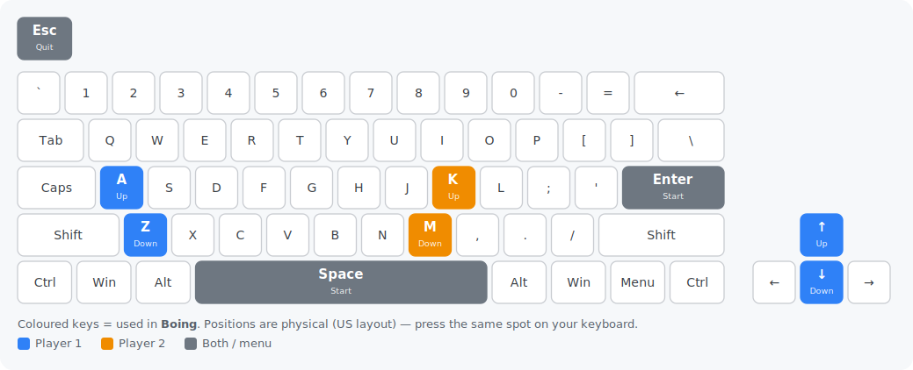

# Boing! — Go port

[](https://github.com/chrplr/boing-go/releases/latest)

**▶ Play it in your browser: <https://chrplr.github.io/boing-go/>**

A Go re-implementation of the Pygame Zero game **Boing!** from *Code the Classics
Volume 1* (Raspberry Pi Press), built on
[go-sdl3](https://github.com/Zyko0/go-sdl3) and the
[pgzgo](https://github.com/chrplr/pgzgo) harness.

All images, sounds and music are embedded, so `go build` produces a single
self-contained binary that needs no asset files at run time.

## Controls

One or two players (Pong-style). Keyboard only.

**Title screen:** press **Up** for one player or **Down** for two, then **Space** / **Enter** to start.

| Action   | Player 1 | Player 2 |
|----------|----------|----------|
| Bat up   | A or Up   | K |
| Bat down | Z or Down | M |

Press **Esc** to quit.

**Playing on a non-US keyboard?** The game reads *physical key positions* (US QWERTY layout), not the printed letters — so on an AZERTY or QWERTZ keyboard a labelled key may sit somewhere else. Find each key on the picture below and press the same spot on your own board.



## Download

Prebuilt, self-contained binaries — no install, no dependencies, assets embedded.
Grab the latest for your platform:

- **Linux** (amd64) — [boing-linux-amd64.tar.gz](https://github.com/chrplr/boing-go/releases/latest/download/boing-linux-amd64.tar.gz)
- **macOS** (Apple Silicon) — [boing-macos-arm64.tar.gz](https://github.com/chrplr/boing-go/releases/latest/download/boing-macos-arm64.tar.gz)
- **Windows** (amd64) — [boing-windows-amd64.zip](https://github.com/chrplr/boing-go/releases/latest/download/boing-windows-amd64.zip)

All versions are on the [releases page](https://github.com/chrplr/boing-go/releases).

## Run

```sh
go run .
```

go-sdl3 bundles the SDL3, SDL3_image and SDL3_mixer libraries and extracts them at
startup, so no system SDL install is needed.

## Provenance & license

Ported to Go from the Python original in *Code the Classics Volume 1*. The game
design and original assets are © their respective authors / Raspberry Pi Press.

The original Python code and assets are in Raspberry Pi Press's [Code the Classics — Volume 1](https://github.com/raspberrypipress/Code-the-Classics-Vol1) repository.

The Go source code of this port is distributed under the MIT License.

See `Python_and_Go_implementation_comparison.md` for a walkthrough of how the port
maps onto the original.
